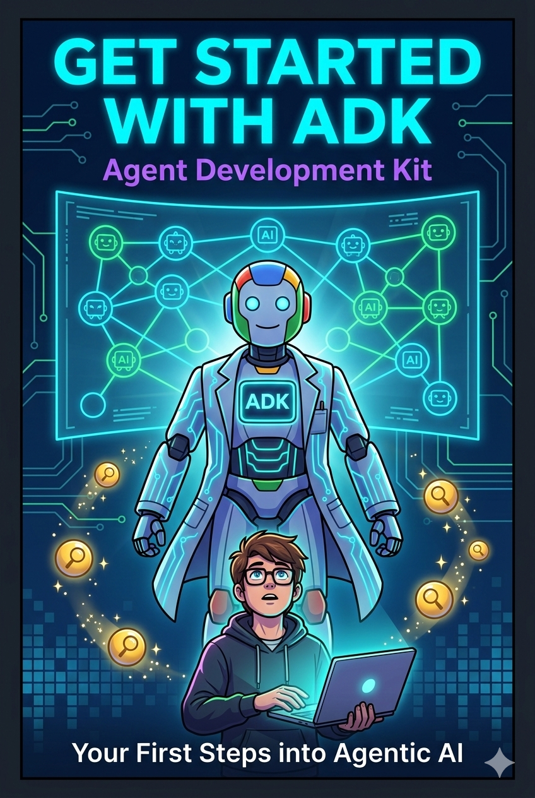
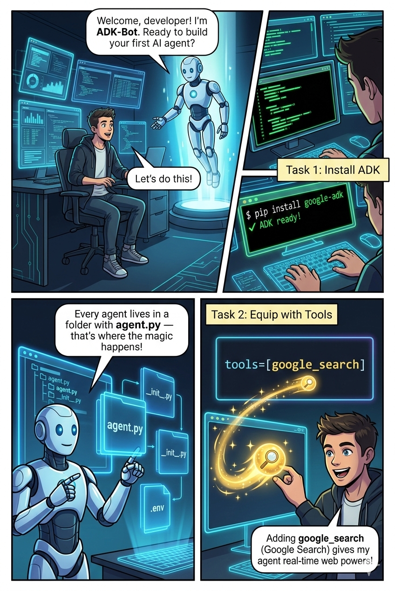
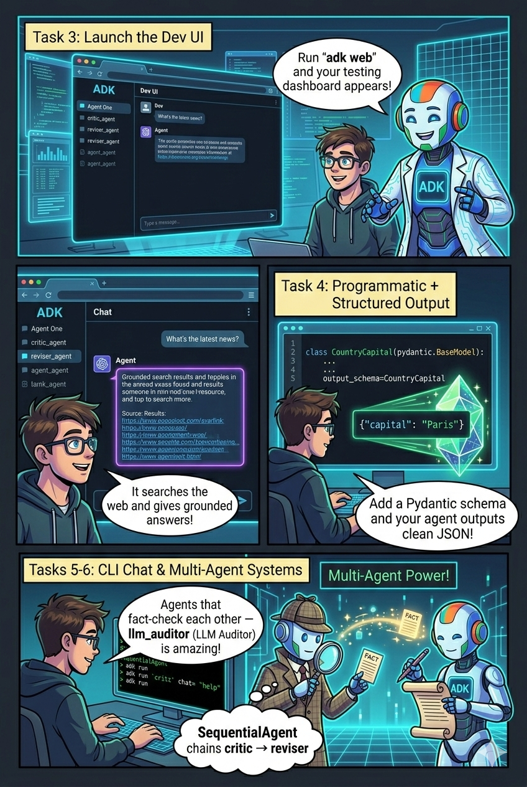
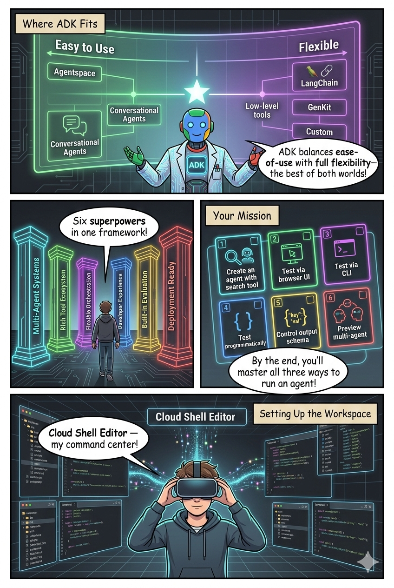
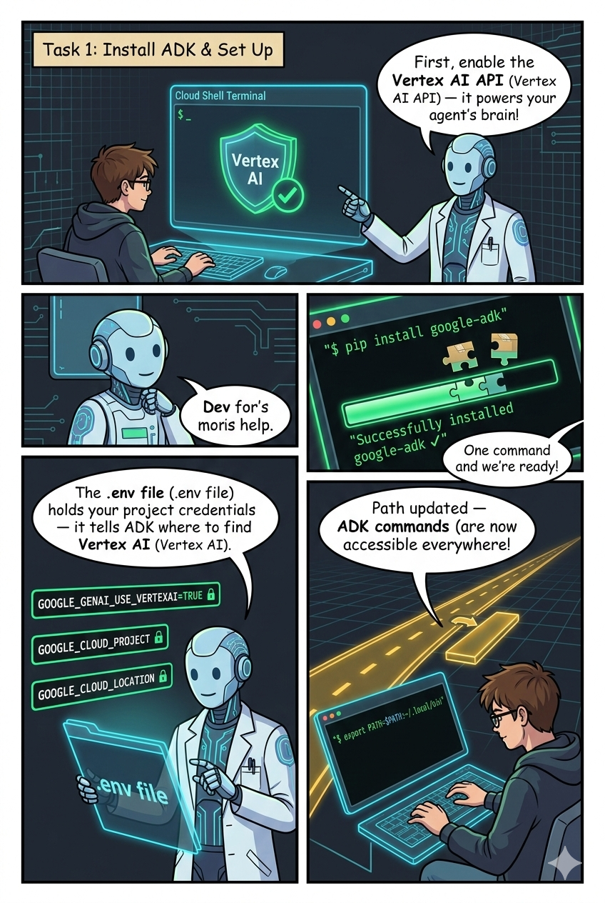
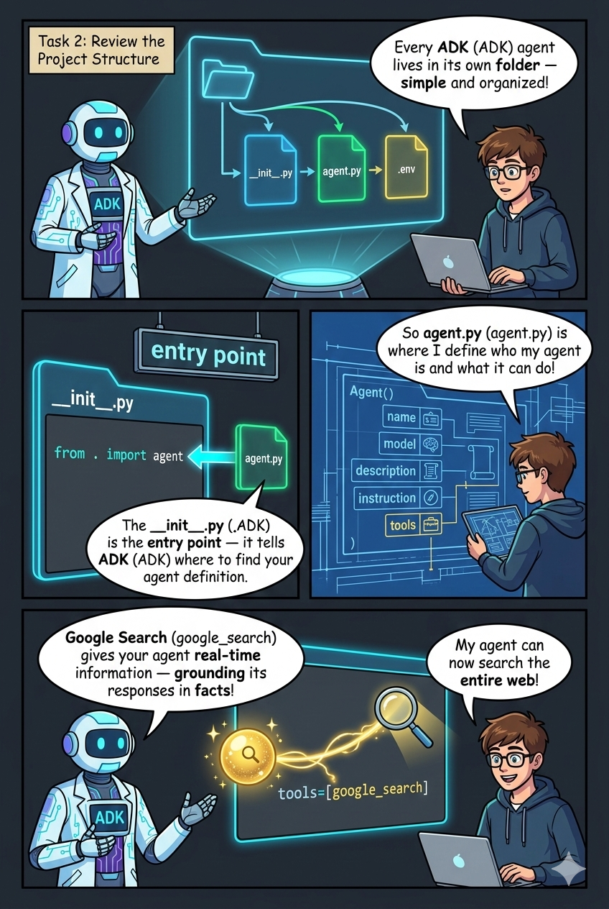
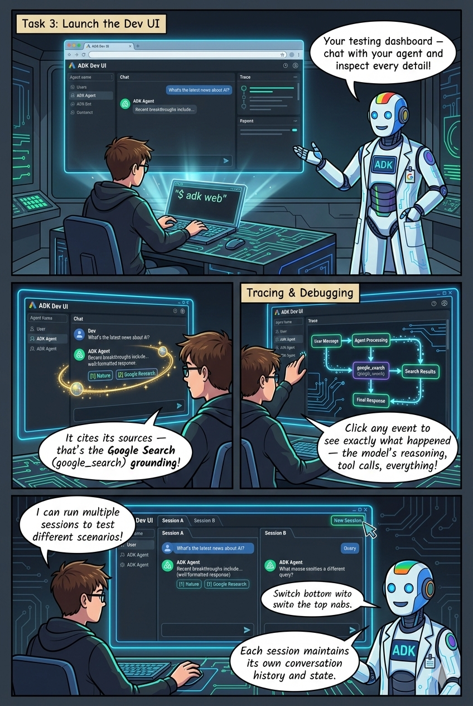
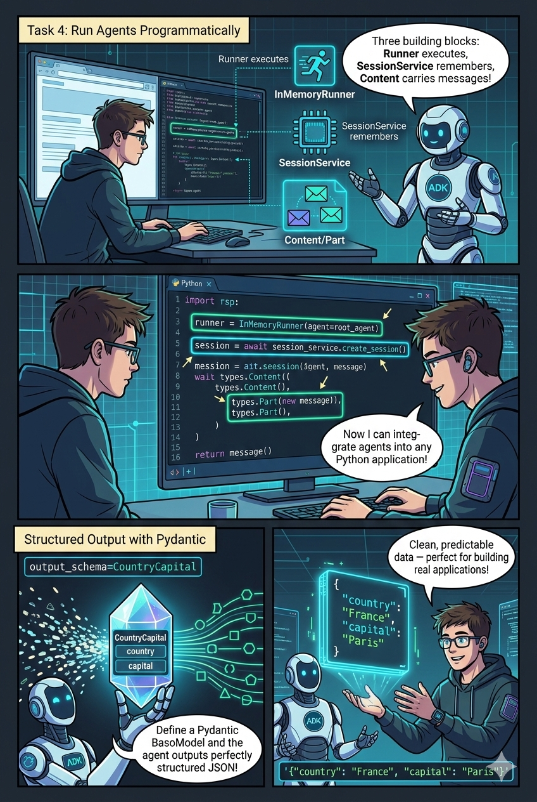

# Get Started with ADK - Comic

## Overview
- **Lab**: Get Started with Google Agent Development Kit (ADK)
- **Art Style**: Tech
- **Pages**: 9 (Cover + 8 pages)
- **Generated on**: 2026-03-01

## Comic Pages

### Cover

### Page 1 - Installation & First Steps

**Content**: Dev meets ADK-Bot who guides them through installing ADK with `pip install google-adk`, understanding the project structure (agent.py, __init__.py), and equipping an agent with the google_search tool.

### Page 2 - Dev UI & Testing

**Content**: Launching the ADK Dev UI with `adk web`, testing grounded search results, using structured output with Pydantic schemas, and previewing multi-agent with SequentialAgent.

### Page 3 - The ADK Ecosystem

**Content**: Where ADK fits in the framework landscape (ease-of-use vs flexibility), ADK's six key capabilities, lab objectives overview, and Cloud Shell workspace setup.

### Page 4 - Install ADK & Environment Setup

**Content**: Enabling Vertex AI API, running `pip install google-adk`, configuring the `.env` file with credentials, and updating the PATH environment variable.

### Page 5 - Project Structure & Agent Anatomy

**Content**: Agent folder structure (__init__.py, agent.py, .env), the Agent() constructor parameters (name, model, description, instruction, tools), and adding google_search for grounding.

### Page 6 - Running with the Dev UI

**Content**: Launching `adk web` command center, grounded search responses with citations, execution tracing and debugging, and running multiple test sessions.

### Page 7 - Running Programmatically with Structured Output

**Content**: InMemoryRunner, SessionService, and Content/Part building blocks. Structured output with Pydantic BaseModel as output_schema for clean JSON responses.

### Page 8 - CLI Chat & Multi-Agent Preview

**Content**: CLI chat with `adk run`, comparison of three ways to run agents, the LLM Auditor preview with critic_agent and reviser_agent, and SequentialAgent introduction.

## Core Knowledge Points
1. **ADK Installation** - `pip install google-adk` and .env configuration
2. **Project Structure** - agent.py + __init__.py in a folder
3. **Agent Parameters** - name, model, description, instruction, tools
4. **Google Search Grounding** - Real-time web search via tools=[google_search]
5. **Dev UI** - `adk web` for visual debugging and tracing
6. **Programmatic Execution** - InMemoryRunner + SessionService
7. **Structured Output** - Pydantic BaseModel as output_schema
8. **CLI Chat** - `adk run` for quick testing
9. **Multi-Agent Preview** - SequentialAgent chains agents together
