# Intro to Inference: How to Run AI Models on a GPU

Learn how to set up and run AI inference on GPUs in Google Cloud. This pathway gets you started with the inference pipeline, model formats, and performance metrics through hands-on examples.

## Training vs. Inference: Components of the inference pipeline

Learn the role of AI inference in production applications and how each step of the inference pipeline comes together to enable fast, large-scale AI applications.

Every AI model has two phases:
1. Training
2. Inference

### Training: The model learns from data. 

Training is when the model learns from data, and inference is when we use the trained model to make predictions. It is thanks to inference that you are able to interact with all the conversational interfaces that are powered by LLMs today.

Inference and training are fundamentally different:
- Training consists of a forward pass and a backward pass, a technique which compares predictions with the ground truth values, compute loss, and update weights based on gradients.

```mermaid
graph LR
    subgraph Training ["AI Model Training"]
        direction LR
        TD["🗄️ Training dataset"]
        FP["Forward pass"]
        PI["📊 Predicted insights"]
        GTL["🗄️ Ground truth labels"]
        LC["⚙️ Loss computation"]
        BP["Backward pass"]
        AN["🧠 AI network<br/>*Weights updated*"]

        TD --> FP --> PI --> LC
        GTL --> LC
        LC --> BP --> AN
        AN --> FP
    end

    style FP fill:#4285f4,color:#fff,stroke:#4285f4
    style BP fill:#4285f4,color:#fff,stroke:#4285f4
```



- Inference is a forward pass only. It takes inputs, computes outputs without any weight update. 

```mermaid
graph LR
    subgraph Inference ["AI Inference"]
        direction LR
        TD["🗄️ Training dataset"]
        AN["🧠 AI network<br/>*Weights frozen*"]
        FP["Forward pass"]
        PI["📊 Predicted insights"]

        TD --> FP
        AN --> FP
        FP --> PI
    end

    style FP fill:#4285f4,color:#fff,stroke:#4285f4
```



Serving LLMs requires answering some important questions:

- How fast can we respond to a request?
- How many users can we serve at once? 
- How much memory and compute do we need?

Inference is not just about running a model once. In production, you need to serve millions of requests, minimize latency and control cost.

That's why you have likely heard that AI runs on GPUs. 

```sh
   ______________________
  /  ________________   /|
 /__/____GPU______/ /  / |
|  |  [==]  [==] | | /  |
|  |            | |/   |
|  |  (o)  (o)  |     |
|  |____________|     |
|_____________________| 
   |||||||||||||||||
     PCIe fingers
```

GPUs are hardware accelerators designed specifically to handle massive mathematical operations inside AI models. 

> GPU; Parallel computations

CPUs are generalists, designed to process data sequentially. 

```sh
    ___________________
   /  _____________   /|
  /__/____CPU_____/  / |
 |  |   [====]    | /  |
 |  |  ( o  o )   |/   |
 |  |    \__/     |    |
 |  |_____________|    |
 |_____________________| 
    |||||||||||||||
     pins / pads
```

> CPU, Sequential operations 

GPUs with thousands of parallel cores are built to multiply and add tensors at scale.

Hardware acceleration becomes possible by parallelizing matrix multiplications, which is the essence of modern AI, and also by running batches of requests in parallel. Without hardware acceleration, modern LLMs and generative AI wouldn't be practical at this scale. 

While GPUs make large-scale inference possible, the process still needs to be optimized. And the LLM inference pipeline provides this structure, usually with the following steps:

1. Preprocessing:
Preparing inputs for the model. For text, that means tokenization. For images, resizing and normalization.

2. Batching and padding:
Converting inputs in a batch into rectangular tensors.

3. Model forward pass:
The trained network computes predictions from the inputs. 

4. Decoding:
Predicting logits step by step.

5. Postprocessing:
Converting predictions into usable outputs (detokenizing text, labeling images, or formatting results) 

6. Serving:
Delivering results to end-users, often combining multiple requests to maximize hardware efficiency.

### Conclusion

Training teaches the model, inference applies it. An AI inference pipeline is the sequence of processing steps where performance, efficiency and user experience come together. 


## Foundations of Inference: Build an inference pipeline

This hands-on lab introduces the fundamental concepts of model inference—how a trained model takes an input and produces an output. We will build a step-by-step understanding of the inference pipeline:
- CPU vs GPU inference: Showing why hardware acceleration matters.
- Pipeline components: Preprocessing, batching & padding, forward pass, decoding, and postprocessing.
- Performance fundamentals: Introducing key principals of inference efficiency, like why batching requests is important for throughput, and why decoding without a cache can cause bottlenecks.

[Code example](./01_foundations_of_inference.ipynb)


## Choosing the right format for your AI model

This article explains the different file formats used to save, share, and deploy AI models. By reading this article, you will learn:
- When to use the most common modern model formats, including Safetensors, GGUF, TensorRT, and ONNX.
- How to choose the right format for your specific needs, from sharing models openly to deploying them for high-performance production.
- The technology that makes it possible to run massive language models on your personal laptop, thanks to formats like GGUF.
- The crucial role that model formats play in the entire lifecycle of a model, from initial training to final deployment.

[Choosing the right format for your AI model: A comprehensive guide to AI inference formats](https://discuss.google.dev/t/choosing-the-right-format-for-your-ai-model-a-comprehensive-guide-to-ai-inference-formats/276691)

## Introduction to inference performance metrics

Understand the core metrics that define AI performance—from Time to First Token (TTFT) to throughput—and see how using percentiles is the key to balancing system efficiency with a consistently great user experience.


Inference performance; Why do some apps feel instant while others take time to execute? 

The answer lies in the inference performance of your AI model. It is the major factor determining usability of your AI system and it is defined by the set of core metrics; In LLMs, those are:
- Total Latency: End-to-end response time 
- Time to first token (TTFT): how fast the first word appear in the model response? 
- Inter-Token Latency (ITL): the rhythm of tokens streaming after the first 
- Throughput: how many requests or tokens per second the system can serve.

Average hides the truth, because they hide variability. Most requests may be fast, but a few of the slow ones can totally ruin the experience. That's why we measure distributions using **percentiles**:

- P50: The median, the typical user experience.
- P90 & P99: The tail latencies, The slowdowns - the worst-case scenarios that users will experience.

And they can be actually applied to any metrics, including throughput Time to First Token, Inter-Token latency.

Percentiles tell us how consistent the performance of our system really is.

Throughput and latency pull in different directions. 

Large batches boost the throughput, but as you can imagine they can also increase latency for individual requests.

> [!NOTE]
> The challenge Is to find the right balance between throughput and latency for your specific use case.

The Knee point shows where batching or scaling gives you the best throughput without pushing latency too high. Past the knee the curve return flattened while your user experience will suffer.

In the end, metrics only matter if they map to user experiences. 

### Inference Applications:
- Chatbots: Low time to first token, immediate response.
- Translation and Summarization: High throughput to handle large workloads.
- Streaming Applications: Steady Inter-Token Latency, so that the flow feels natural.
- On-device AI: Small model footprint for speed but also for low power consumption.

Tail latencies P90 and P99 ensure fairness so that no user gets stuck waiting 

### Conclusion

Percentiles reveal the real distribution and not just averages. 
The Knee point helps balancing between the throughput and the latency, and combining all these with the UX it's how we make AI fast and reliable.

## Measure and understand inference metrics: Latency, throughput, and UX

This hands-on lab introduces key performance aspects of running AI inference. You’ll learn how to:
- Define and measure the core metrics of latency (the time it takes to get a response) and throughput (how many requests a model can handle over time).
- Analyze the trade-offs between latency and throughput and why optimizing for one often impacts the other.
- Identify key parameters—like batch size, prompt length, and sampling strategy—and how they directly affect inference performance.
- Interpret LLM latency measurements, including how to measure and visualize p50 vs p90 latency and first-token versus total latency.
- Find the "sweet spot" by balancing these technical metrics to deliver the best possible real-world user experience.

[Code sample](./02_measure_and_understand_inference_metrics.ipynb)